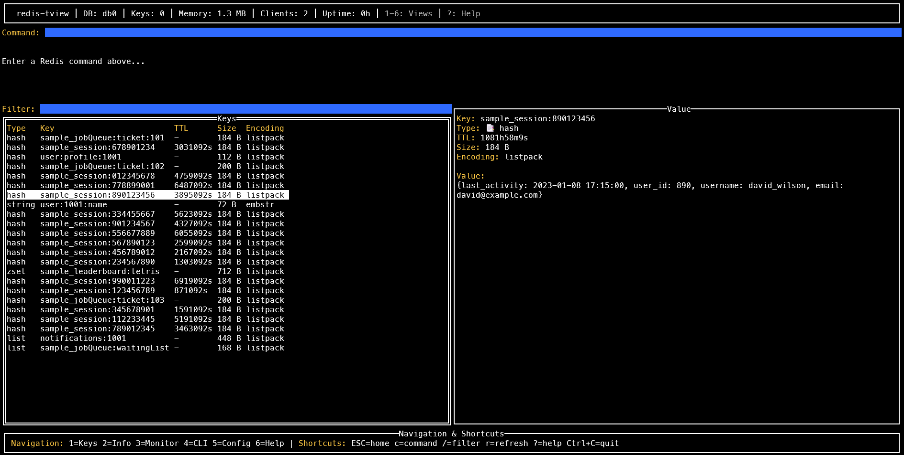

# redis-cli-dashboard

[](https://goreportcard.com/report/github.com/mohan-s-gopal/redis-cli-dashboard)
[](https://github.com/mohan-s-gopal/redis-cli-dashboard/releases)
[](https://opensource.org/licenses/MIT)

A powerful, k9s-inspired Terminal User Interface (TUI) Redis/Valkey client built with Go. Provides an intuitive, keyboard-driven interface for Redis database management with real-time monitoring, advanced key management, and built-in CLI functionality.

<!-- Demo GIF - replace with actual recording -->


## 🌟 Features

- 🎯 Multi-View Navigation
- 🔧 Advanced Key Management
- 📊 Real-time Monitoring
- 💻 Integrated CLI
- ⚙️ Configuration Management
- 🎨 User Experience

## 🚀 Quick Start

### Installation

#### Option 1: Download Pre-built Binaries (Recommended)
```bash
# Linux (x86_64)
curl -L https://github.com/mohan-s-gopal/redis-cli-dashboard/releases/latest/download/redis-cli-dashboard_Linux_x86_64.tar.gz | tar xz
sudo mv redis-cli-dashboard /usr/local/bin/

# Linux (ARM64)
curl -L https://github.com/mohan-s-gopal/redis-cli-dashboard/releases/latest/download/redis-cli-dashboard_Linux_arm64.tar.gz | tar xz
sudo mv redis-cli-dashboard /usr/local/bin/

# macOS (Intel)
curl -L https://github.com/mohan-s-gopal/redis-cli-dashboard/releases/latest/download/redis-cli-dashboard_Darwin_x86_64.tar.gz | tar xz
sudo mv redis-cli-dashboard /usr/local/bin/

# macOS (Apple Silicon)
curl -L https://github.com/mohan-s-gopal/redis-cli-dashboard/releases/latest/download/redis-cli-dashboard_Darwin_arm64.tar.gz | tar xz
sudo mv redis-cli-dashboard /usr/local/bin/

# Windows (PowerShell)
Invoke-WebRequest -Uri "https://github.com/mohan-s-gopal/redis-cli-dashboard/releases/latest/download/redis-cli-dashboard_Windows_x86_64.zip" -OutFile "redis-cli-dashboard.zip"
Expand-Archive -Path "redis-cli-dashboard.zip" -DestinationPath "."
# Add to PATH or move to desired location
```

#### Option 2: Install via Go
```bash
go install github.com/mohan-s-gopal/redis-cli-dashboard@latest
```

#### Option 3: Build from Source
```bash
git clone https://github.com/mohan-s-gopal/redis-cli-dashboard.git
cd redis-cli-dashboard
go build -o redis-cli-dashboard ./cmd
```

### Verify Installation

```bash
# Check version
redis-cli-dashboard -version

# Test connection to local Redis
redis-cli-dashboard

# Should display the TUI interface if Redis is running on localhost:6379
```

### Running

```bash
# Start with default settings (localhost:6379)
./redis-cli-dashboard

# Connect to specific Redis instance
./redis-cli-dashboard -host redis.example.com -port 6380 -db 1

# Enable debug logging
./redis-cli-dashboard -v 2
```

## 📋 Command Line Options

```
Usage: redis-cli-dashboard [OPTIONS]

Connection Options:
  -host string        Redis host (default "localhost")
  -port int           Redis port (default 6379)
  -password string    Redis password
  -db int             Redis database number (default 0)

Application Options:
  -config string     Config file path (default "~/.redis-cli-dashboard/config.yaml")
  -v int             Verbosity level 0-4 (default 0)
  -version           Show version information

Examples:
  redis-cli-dashboard                                    # Connect to localhost:6379
  redis-cli-dashboard -host prod.redis.com -port 6380    # Connect to remote Redis
  redis-cli-dashboard -db 2 -v 2                         # Use database 2 with debug logging
```

### Configuration

Create `~/.redis-cli-dashboard/config.yaml`:

```yaml
redis:
  host: "localhost"
  port: 6379
  password: ""
  db: 0
  timeout: 5000
  pool_size: 10

ui:
  theme: "default"
  refresh_interval: 1000
  max_keys: 1000
  show_memory: true
  show_ttl: true
```

## 🎮 Navigation & Controls

### Global Navigation
| Key | Action |
|-----|--------|
| `1` | Switch to Keys view (main screen) |
| `2` | Switch to Info view |
| `3` | Switch to Monitor view |
| `4` | Switch to CLI view |
| `5` | Switch to Config view |
| `6` | Switch to Help view |
| `ESC` | Return to main screen (Keys view) |
| `?` | Show help modal |
| `Ctrl+C` | Quit application |
| `Ctrl+R` | Refresh current view |

### Keys View
| Key | Action |
|-----|--------|
| `↑/↓` | Navigate keys |
| `Enter` | View key details |
| `/` | Focus filter input |
| `c` | Focus command input |
| `r` | Refresh key list |
| `d` | Delete selected key |
| `e` | Edit selected key |
| `t` | Set/modify TTL |

### CLI View
| Key | Action |
|-----|--------|
| `Enter` | Execute command |
| `↑/↓` | Navigate command history |
| `Ctrl+L` | Clear screen |
| `Tab` | Command completion (if available) |

### Monitor View
| Key | Action |
|-----|--------|
| `s` | Start/stop monitoring |
| `c` | Clear screen |
| `r` | Refresh metrics |


## 🔧 Development

### Prerequisites
- Go 1.19 or later
- Redis/Valkey server for testing
- Terminal with color support

### Building from Source
```bash
git clone https://github.com/mohan-s-gopal/redis-cli-dashboard.git
cd redis-cli-dashboard
go mod tidy
go build -o redis-cli-dashboard ./cmd
```

### Running Tests
```bash
# Run all tests
go test ./...

# Run with coverage
go test -v -cover ./...

# Run specific test
go test -v ./internal/redis
```

### Development Workflow
1. Make changes to source code
2. Run tests to ensure functionality
3. Build and test the application
4. Submit pull request with description
